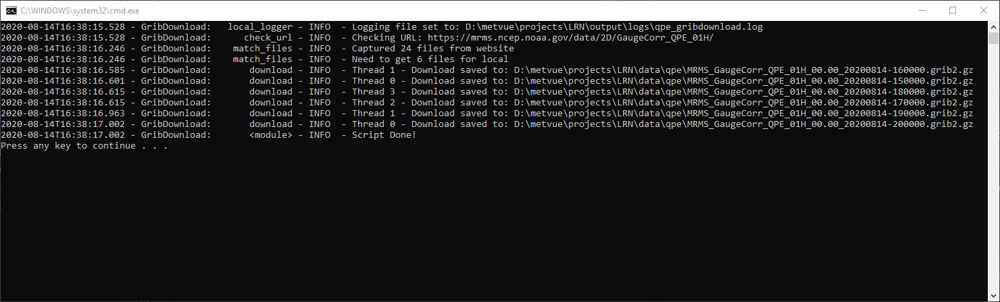

# Grib File Downloader

## Description

This Python script can be used to download Quantitative Precipitation Estimates (QPE), Quantitative Precipitation Forecasts (QPF), or High-Resolution Rapid Refresh (HRRR) precipitation Gridded Binary (GRIB2) files.  These products are provided by NOAA on public websites.  QPE and QPF sources only provide a select number of observed (QPE) and forecasted (QPF) products.  HRRR files are downloaded from [nomads.ncep.noaa.gov](https://nomads.ncep.noaa.gov/) Grib Filter application extracting the variable PRATE (precip rate) at the surface level.

## Installation

This Grib downloader, `gribdownload`, was written in Python 2.7 to allow integration into CWMS/RTS CAVI.  Download from the `master` branch for the most stable version.  Users should review their available Python installation(s) to determine the best way for them to run this script.  Adding a shebang and using `cmd` file (Windows) is a good way to run the script.

## Required Options/Arguments

- Output directory (-o or --output-dir)
- Product type (qpe, qpf, or hrrr).

## Downloading Products

### QPE

|Argument|Options|Description|
|---|---|---|
|-p <br /> --product|MultiSensor_Pass1*, MultiSensor_Pass2, or RadarOnly|Defines the QPE product type.  MultiSensor_Pass1 is the default|
|-i <br /> --interval|1*, 3, 6, 12, 24, 48, or 72|Defines the QPE total precipitation interval.  1 Hour is the default interval|

---

### QPF

|Argument|Options|Description|
|---|---|---|
|-i <br /> --interval|6*,24,48,120|Forecast time intervals|
|-c <br /> --cycle|HOUR (integer)|The cycle is NOAA's forecasting cycle hour as UTC.  The default hour is taken from system time|

---

### HRRR

|Argument|Options|Description|
|---|---|---|
|-c <br /> --cycle|HOUR (integer)|The cycle is NOAA's forecasting cycle hour as UTC.  The default hour is taken from system time|
|-f <br /> --fct-hour |Range and/or comma delimited hours|Default range is 0-18 hours resulting in 0,1,2,3,4,...18|
|--left-lon |0|Extract a geographic subsection, Left Longitude|
|--right-lon |360|Extract a geographic subsection, Right Longitude|
|--top-lat |90|Extract a geographic subsection, Top Latitude|
|--bottom-lat |-90|Extract a geographic subsection, Bottom Latitude|

---

## Command Line Usage

- Print Help

  ```cmd
  python GribDownload.py -h [--help]
  ```

- Download QPE

  ```cmd
  python GribDownload.py -o /path/to/output/dir qpe
  ```

- Download QPE grib files not on user's system using defined working directory, defined output directory, and output log to file.

  ```cmd
  GribDownload.py --working-dir /path/to/working \
  --output-dir /path/to/output \
  --log-file /path/to/working/file.log \
  qpe
  ```

  

- Download 6-hour QPF for the latest forecast cycle based on user's system time.  System time and available forecasts don't always match resulting in no files downloaded.

  ```cmd
  GribDownload.py --working-dir /path/to/working \
  --output-dir /path/to/output \
  --log-file /path/to/working/file.log \
  qpf
  ```